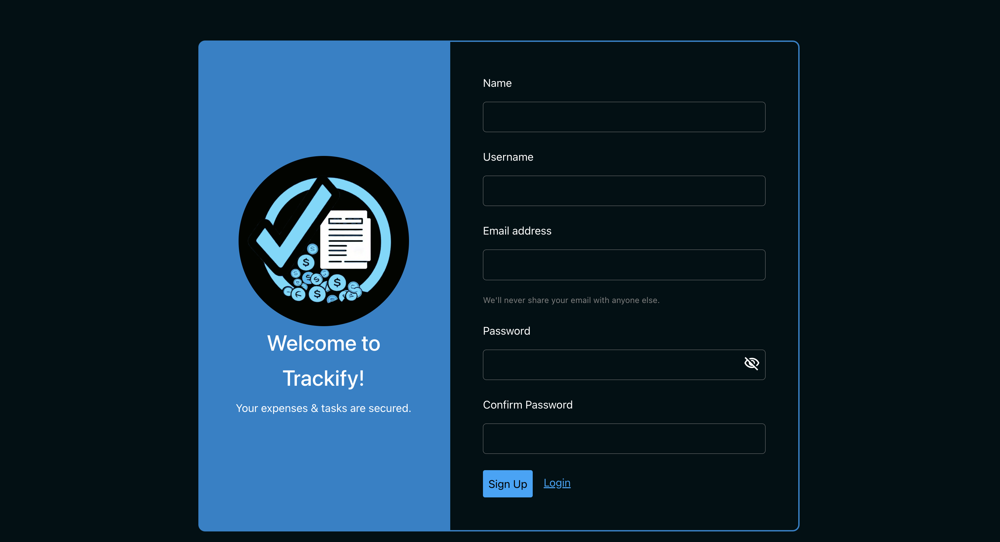
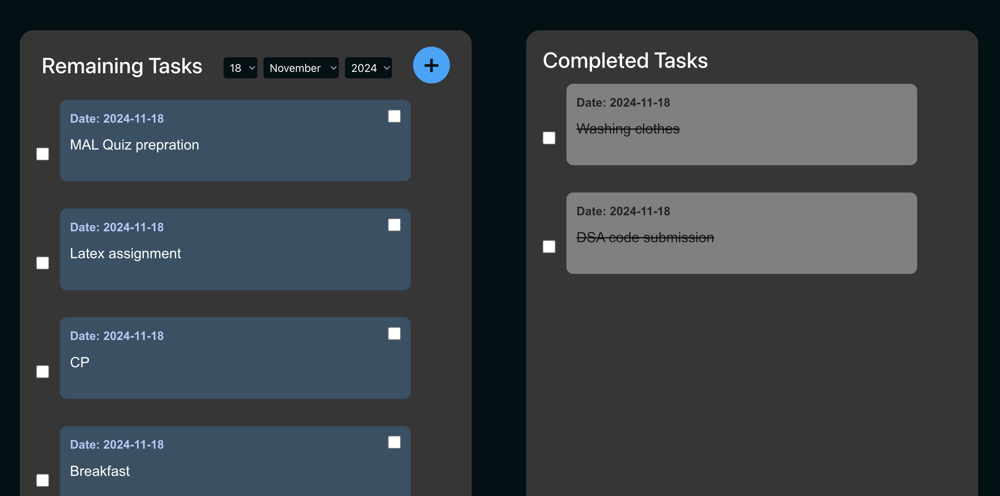
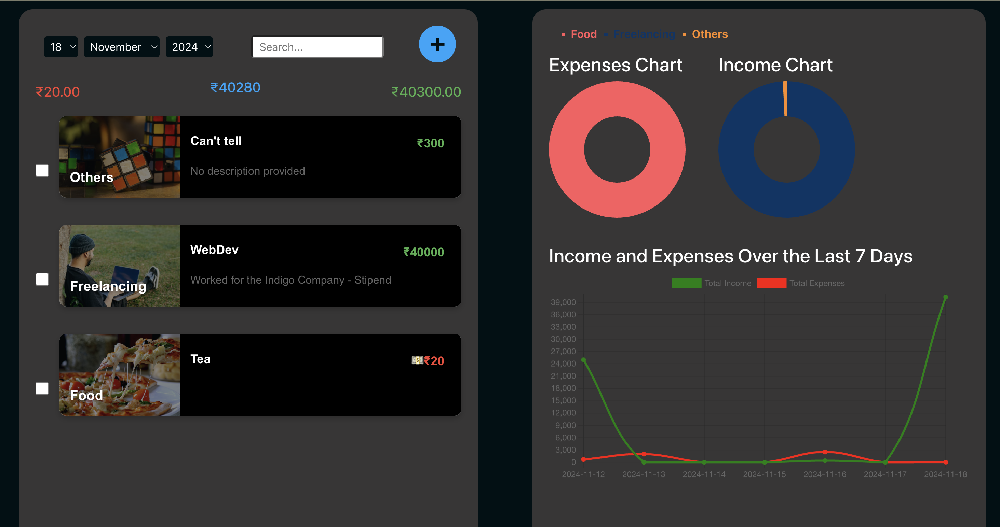

# Personalized Expense Tracker & To-Do Manager

A comprehensive web application developed as part of the **CSP203** course project for the 2024-25M semester. This platform empowers users to efficiently manage their tasks and finances through a user-friendly interface and robust functionality.

---

## 🎯 Features

### 📝 To-Do Management
- **CRUD Operations**: Create, view, edit, and delete to-dos.
- **Task Completion**: Each to-do card has a checkbox. Clicking it marks the task as completed, moving it from the **Uncompleted** (left) to the **Completed** (right) section with a **strike-through**.
- **Latest First**: To-do cards are displayed in a **latest first** fashion.
- **Categorized View**: 
  - **Uncompleted Tasks**: Listed on the left.
  - **Completed Tasks**: Displayed on the right with a **strike-through** style.

### 💰 Expense Tracking
- **CRUD Operations**: Manage income and expense entries with detailed descriptions.
- **Categorization**: 
  - Classify entries as **Income** or **Expense**.
  - Subcategories such as **Food**, **Entertainment**, etc.
- **Dynamic Card Appearance**: 
  - The card's appearance, including the icon and amount color, changes based on category and subcategory (e.g., red for expenses, green for income).
  - A cash/card symbol dynamically changes based on the card’s info.
- **Search & Filters**: 
  - View expenses for a specific day, the last week, or the last month.
  - Corresponding graphs update dynamically.
- **Charts**: 
  - **Pie Chart**: Category-wise expenses for one day.
  - **Line Chart**: Track expenses over the last week.
  - **Line Chart**: Track expenses over the last month.
  - **Chart.js** and **React Chart.js 2** are used for generating dynamic, interactive charts.
- **Latest First**: Expense cards are displayed in **latest first** fashion.
- **Graphs & Insights**: 
  - Visualize spending patterns via dynamic charts.

### 🔐 Authentication
- User registration and login via **JWT-based authentication**.
- **Bcrypt** is used for hashing passwords.
- **Express Validators** check whether the email and password are in the correct format.
- Secure session management with logout functionality.

---

## 📸 Screenshots

### Signup Page


### To-Do Page


### Expense Page


## 🛠️ Tech Stack

- **Frontend**: React.js
- **Backend**: Node.js, Express.js
- **Database**: MongoDB
- **Authentication**: JWT (JSON Web Tokens)

---

## 📂 Folder Structure

root/
├── Frontend/               # Frontend React app
│   ├── src/
│   │   ├── components/     # Reusable UI components
│   │   ├── context/        # Context for managing global state (To-Do, Expenses, etc.)
│   │   ├── utils/          # Utility functions
│   │   └── App.js          # Main application entry point
│   ├── node_modules/       # Modules for the frontend
│   ├── package.json        # Frontend project dependencies
│   └── package-lock.json   # Frontend dependencies lock file
├── backend/                # Backend API
│   ├── models/             # MongoDB models (User, Todo, Expense)
│   ├── routes/             # API routes
│   ├── middleware/         # JWT and error handling middleware
│   ├── index.js            # Main server entry point
│   ├── db.js               # MongoDB database connection
│   ├── node_modules/       # Modules for the backend
│   ├── package.json        # Backend project dependencies
│   └── package-lock.json   # Backend dependencies lock file
├── README.md               # Project documentation

## 🚀 Installation

To get started with the project, follow these steps:

1. **Clone the repository**:
   ```bash
   git clone https://github.com/your-username/Personalised-expense-tracker-and-todo---CSP203.git
   cd Personalised-expense-tracker-and-todo---CSP203

2. **Navigate back to the backend directory:**:
   ```bash
   cd backend

3. **Install backend dependencies:**:
   ```bash
   npm install

4. **Navigate back to the Frontend directory:**:
   ```bash
   cd ../Frontend

5. **Install backend dependencies:**:
   ```bash
   npm install

5. **Run both the Frontend and backend:**:
   ```bash
   npm run both

## 🚧 Future Improvements

While the project is functional, there are several areas that could be enhanced in the future:

- **Mobile App Version**: Develop a mobile version of the application for iOS and Android.
- **Advanced Data Visualizations**: Add more dynamic charts like bar charts and heatmaps to provide deeper insights into expenses.
- **User Profiles**: Allow users to have more customizable profiles and settings for a personalized experience.
- **Real-time Notifications**: Add real-time notifications for upcoming bills, tasks, or spending alerts.
- **Improved Security**: Integrate multi-factor authentication (MFA) for enhanced security during login.

## 🤝 Contributors

This project was developed collaboratively by the following team members:

- **[Slok Tulsyan](https://github.com/Slok9931)**
- **[Siddharth Jay Prakash Rai](https://github.com/SidRai-247)**
- **[Sneha Nagmoti](https://github.com/snehanagmoti)**
- **[Krishna Jhanwar](https://github.com/krishnaj01)**

Each member contributed to various aspects of the project, from frontend development to backend implementation.


